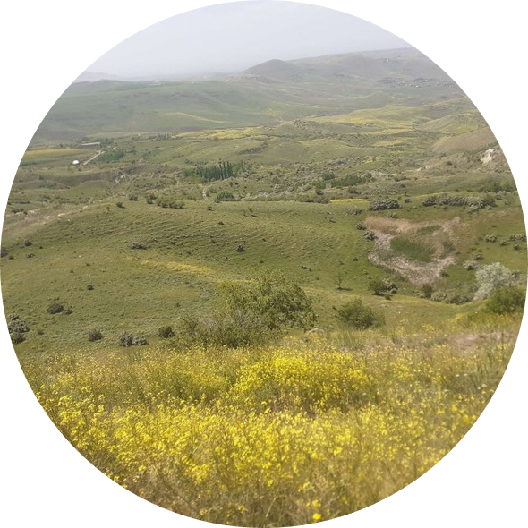

  

## Hi there 👋, I'm Andrey!

Welcome to my GitHub profile! Feel free to browse through my projects and get in touch if you'd like to collaborate.

## 💡 About Me
- Python Junior Developer
- Tech geek and open-source enthusiast.
- Fan of Google products
- Living in 🇺🇦 Ukraine

## 📬 Contacts
- Telegram: [@andrey4ik21pro1](https://t.me/andrey4ik21pro1)

## 💖 Support My Work
Donations are always welcome and help me dedicate more time to creating content and open-source projects.

- USDT (TON): `UQC6nQbdL8oTBfbSxKZcjH04ICsHRCemFQPo2XAu65t1P8fd`
- ETH: `0xa369b5c4690F1A36Cff5bEA25A5bD1776d26969E`
- BTC: `bc1qlzx50nqwm6pthd2j3z74ecq3qx6s2sjsn38gld`

## 🛠 Tech Stack

  

## 📊 My GitHub Statistics

    

